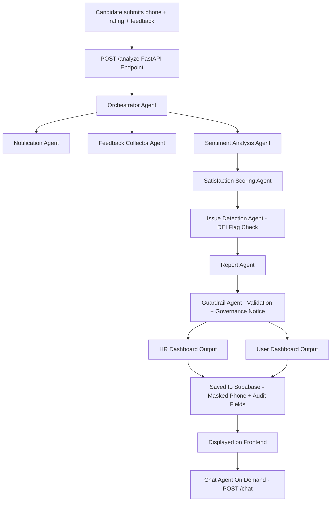

# 🤖 Agentic JSO Platform — Candidate Experience Multi-Agent System

---

## 📌 Overview

The Agentic JSO Platform introduces an AI-driven multi-agent architecture to enhance candidate consultation experiences, automate feedback analysis, and provide intelligent insights for HR consultants and administrators.

Phase-1 relied on static dashboards and manual workflows.
Phase-2 introduces autonomous AI agents capable of reasoning, analyzing feedback, scheduling consultations, generating satisfaction scores, and ensuring responsible AI governance through guardrail validation and human-in-the-loop review.

---

## 🧠 End-to-End Agent Workflow (Flow Diagram)



---

## 🎯 Why Agentic AI in Phase-2

* Automatically analyze candidate feedback after HR consultation sessions
* Generate explainable satisfaction scores using sentiment + rating fusion
* Automate consultation scheduling
* Send reminders via WhatsApp / Email
* Enable personalized job recommendations
* Improve scalability and reduce manual workload
* Ensure responsible AI through guardrail validation

---

## ⚠️ Limitations in Phase-1

* Manual consultation scheduling
* No AI-driven feedback insights
* No automated satisfaction scoring
* Limited HR performance analytics
* No explainability mechanism
* No AI job recommendation engine

---

## 🚀 How AI Agents Improve Experience

* Automated feedback analysis
* Intelligent scheduling workflows
* Real-time AI chat career assistant
* Notification automation
* Personalized recommendations
* Reduced admin workload
* Safe AI outputs via governance guardrails
* Human-review override capability

---

## 🧠 Candidate Experience Agent Design

### Agent Type

Multi-Agent Sequential Pipeline coordinated by **Orchestrator Agent**

### Key Capabilities

* Sentiment analysis on consultation feedback
* Satisfaction score generation
* Career chat assistance
* CV + job recommendation capability
* Governance validation layer
* Human-in-loop accountability

---

## ⚙️ Automated Tasks

* Session scheduling
* Feedback collection
* Sentiment + satisfaction scoring
* Issue detection (DEI flags)
* Consultation report generation
* Notification delivery
* Trend-based HR evaluation

---

## 📊 Dashboard Integration

### 👤 User Dashboard

* Book consultations
* Chat with AI career assistant
* Submit feedback
* View satisfaction insights
* Download consultation reports
* Receive personalized job suggestions

### 👨‍💼 HR Dashboard

* View feedback analytics
* Monitor consultant performance
* Identify recurring issues
* Fair evaluation via trend analysis

### 🧑‍💻 Super Admin Dashboard

* Platform-wide satisfaction analytics
* Performance trend monitoring
* Complaint pattern detection
* AI governance monitoring

### 📜 Licensing Dashboard

* Track consultation limits
* Trigger renewal alerts

---

## 🧩 Problem Solved

* No automated consultation quality measurement
* Manual workflow inefficiencies
* Slow doubt resolution for candidates
* Lack of structured feedback intelligence
* Biased single-feedback HR evaluation

---

## 🌍 Real Scenario

1. Candidate books session
2. AI scheduling agent confirms timing
3. Reminder sent via WhatsApp
4. Candidate chats with AI for CV advice
5. Feedback auto-collected post session
6. AI generates explainable satisfaction score
7. Guardrail validation ensures fairness
8. HR reviews before dashboard publishing
9. Report generated + downloadable
10. Candidate continues AI chat interaction

---

## 🏗️ Technical Architecture

* **Frontend:** NextJS + React
* **Backend:** FastAPI / NodeJS APIs
* **AI Prototype:** CrewAI + OpenAI
* **Production Stack:** AWS Bedrock
* **Serverless:** AWS Lambda
* **Database:** Supabase
* **Storage:** AWS S3
* **Deployment:** Vercel + Render
* **Governance:** Guardrail validation layer

---

## 🔗 Data Flow Integration

```
Frontend → API → Orchestrator Agent → Sub Agents → Guardrail → Supabase → Dashboard
```

---

## ⏱️ Timeline

| Phase                | Duration    |
| -------------------- | ----------- |
| Architecture Design  | 1 Week      |
| AI Agent Development | 3 Weeks     |
| Testing              | 1 Week      |
| Deployment           | 1 Week      |
| **Total**            | **6 Weeks** |

---

## 🔮 Future Enhancements

* Advanced job recommendation models
* HANDLING test cases via pydantic for proper country code ,feedbacks
* Resume scoring engine
* Evaluation metrics to be added
* Redis celery to handle multiple users
* Consultant performance prediction
* RL-based scheduling optimization
* Multilingual AI assistant

---

## 📌 Conclusion

Agentic JSO transforms a static consultation platform into a **scalable, intelligent, and responsible AI ecosystem** by combining multi-agent reasoning, workflow automation, and governance guardrails to improve candidate experience and enable data-driven HR insights.
